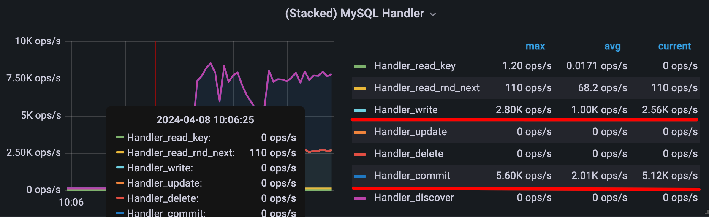
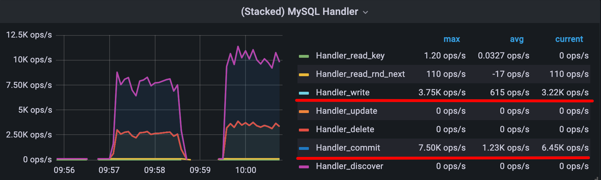
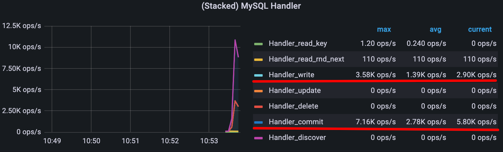

# Queries

```sql
1. SELECT SQL_NO_CACHE * FROM user WHERE birthday = 2022-01-01
2. SELECT SQL_NO_CACHE * FROM user WHERE MONTH(birthday) = 1
3. SELECT SQL_NO_CACHE * FROM user WHERE YEAR(birthday) = 2001
4. SELECT SQL_NO_CACHE * FROM user WHERE YEAR(CURDATE()) - YEAR(birthday) = 30
5. SELECT SQL_NO_CACHE * FROM user WHERE birthday BETWEEN 1990-01-01 AND 2023-12-31
```

## No indexes
### Explain results
| query | select_type | table | type | possible_keys | key | key_len | ref | rows | extra |
|-------|-------------|-------|------|---------------|-----|---------|-----|------|-------|
| 1     | SIMPLE      | user  | ALL  | NULL          | NULL| NULL    | NULL| 65156480    |   Using where    |
| 2     | SIMPLE      | user  | ALL  | NULL          | NULL| NULL    | NULL| 65156480    |   Using where    |
| 3     | SIMPLE      | user  | ALL  | NULL          | NULL| NULL    | NULL| 65156480    |   Using where    |
| 4     | SIMPLE      | user  | ALL  | NULL          | NULL| NULL    | NULL| 65156480    |   Using where    |
| 5     | SIMPLE      | user  | ALL  | NULL          | NULL| NULL    | NULL| 65156480    |   Using where    |


### Execution time
| query | time (seconds)     |
|-------|--------------------|
| 1     | 33.19393491744995  |
| 2     | 36.93291211128235  |
| 3     | 33.98404121398926  |
| 4     | 35.396281719207764 |
| 5     | 48.32204008102417  |

## B-Tree index
### Explain results
| query | select_type | table | type  | possible_keys | key | key_len | ref   | rows | extra |
|-------|-------------|-------|-------|---------------|-----|---------|-------|------|-------|
| 1     | SIMPLE      | user  | ref   | idx_birthday  | idx_birthday| 3       | const | 1475 |   Using where; Using index    |
| 2     | SIMPLE      | user  | index | NULL          | idx_birthday| 3       | NULL  | 65156480    |   Using where; Using index    |
| 3     | SIMPLE      | user  | range | idx_birthday  | idx_birthday| 3       | NULL  | 1023212    |   Using where; Using index    |
| 4     | SIMPLE      | user  | index | NULL          | idx_birthday| 3       | NULL  | 65156480    |   Using where; Using index    |
| 5     | SIMPLE      | user  | range | idx_birthday      | idx_birthday| 3       | NULL  | 1    |   Using where; Using index    |


### Execution time
| query | time (seconds)     |
|-------|--------------------|
| 1     | 0.010661125183105469  |
| 2     | 16.645680904388428  |
| 3     | 0.6850929260253906  |
| 4     | 14.56387186050415 |
| 5     | 28.119817972183228  |


## Hash index
### Explain results
| query | select_type | table | type  | possible_keys | key | key_len | ref   | rows | extra |
|-------|-------------|-------|-------|---------------|-----|---------|-------|------|-------|
| 1     | SIMPLE      | user  | ref   | idx_birthday  | idx_birthday| 3       | const | 1475 |   Using where; Using index    |
| 2     | SIMPLE      | user  | index | NULL          | idx_birthday| 3       | NULL  | 65156480    |   Using where; Using index    |
| 3     | SIMPLE      | user  | range | idx_birthday  | idx_birthday| 3       | NULL  | 1023212 |   Using where; Using index    |
| 4     | SIMPLE      | user  | index | NULL          | idx_birthday| 3       | NULL  | 65156480    |   Using where; Using index    |
| 5     | SIMPLE      | user  | range | idx_birthday      | idx_birthday| 3       | NULL  | 1    |   Using where; Using index    |

### Execution time
| query | time (seconds)     |
|-------|--------------------|
| 1     | 0.004003047943115234  |
| 2     | 13.89442491531372  |
| 3     | 0.8840439319610596  |
| 4     | 12.41253113746643 |
| 5     | 29.56740975379944  |


## Analysis

- **Query 1**: Hash index outperforms B-tree index, suggesting it is more efficient for exact match queries.
- **Query 2 & 4**: Hash index shows better performance for complex queries, possibly indicating 
better overall efficiency in this dataset.
- **Query 3**: B-tree index slightly outperforms Hash index, hinting at its 
efficiency in range queries or sorted data operations.
- **Query 5**: Similar performance, with a slight edge for the B-tree index in this instance.

## Decision

- **For exact match queries**: Hash index appears to be more efficient.
- **For range queries and operations requiring sorted data**: B-tree index may offer advantages.

The choice between B-tree and Hash indexes should be guided by 
the most common query patterns in your application. For applications dominated by exact match searches, 
Hash indexes might be preferred. If your application requires flexibility for range queries and sorting, 
B-tree indexes might be more suitable.

## Conclusion

Both B-tree and Hash indexes have their strengths and weaknesses. The choice of index should be based on the 
specific requirements and query patterns of your application. This comparison serves as a general guide; 
however, testing with your specific dataset and queries is recommended to make the best decision for your use case.

## InnoDB Optimization

### --innodb-flush-log-at-trx-commit=1 (default)



### --innodb-flush-log-at-trx-commit=0

As we can see from the graph, the performance of the database is significantly 
improved when the `--innodb-flush-log-at-trx-commit=0` option is used. 
This is because the log buffer is flushed to the log file once per second, 
reducing the number of disk writes and improving performance.

### --innodb-flush-log-at-trx-commit=2


| trx_commit | handler_write current (ops/s) | handler_write avg (ops/s) | handler_write max (ops/s) | handler_commit current (ops/s) | handler_commit avg (ops/s) | handler_commit max (ops/s) |
|------------|-------------------------------|---------------------------|---------------------------|--------------------------------|----------------------------|----------------------------|
| 1          | 2.56k                         | 1.00k                     | 2.80k                     | 5.12k                          | 2.01k                      | 5.60k                      |
| 0          | 3.22k                         | 615                       | 3.75k                     | 6.45k                          | 1.23k                      | 7.50k                      |
| 2          | 2.90k                         | 1.39k                     | 3.58                      | 5.80k                          | 2.78k                      | 7.16k                      |


## Conclusion
The data suggests a complex relationship between transaction commits and handler operations (both write and commit). 
Notably, higher transaction commits do not straightforwardly result in higher operation rates, indicating that 
other factors may be influencing performance. Additionally, the commit operations seem to be consistently higher 
than write operations, possibly indicating a specific system behavior or configuration where commits are more frequent 
or batched differently than writes. The variability in max operation rates compared to average and current rates 
suggests that the system can handle spikes in operations but doesn't always operate at this peak level.